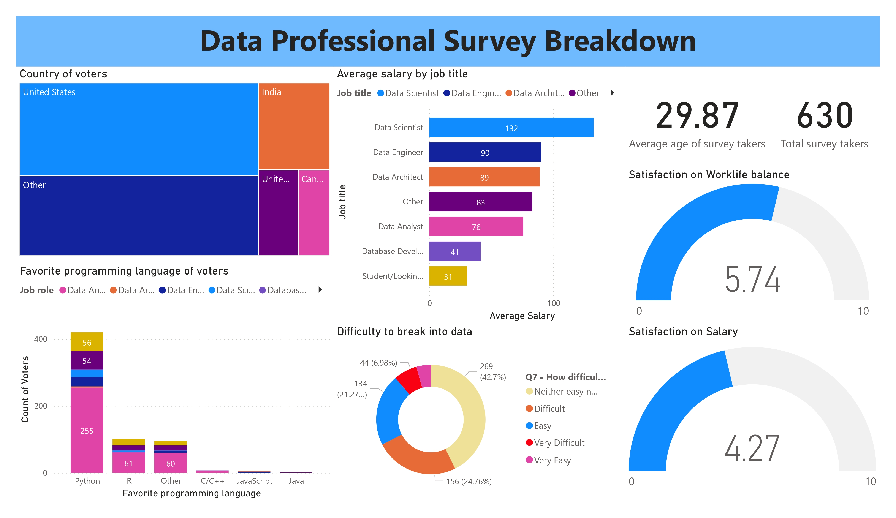

# Arjunvk_portfolio
Business/Data analytics portfolio projects to showcase skills in analytics tools
## Project 1: Data Professional Survey Breakdown PowerBI Portfolio Project
### Description
The Power BI dashboard created for the data professional survey provides a comprehensive and insightful view of the survey results. The dashboard is designed to highlight the key trends and patterns that emerged from the survey, making it easy for users to quickly and efficiently analyze the data.

The dashboard features a range of interactive visualizations, including bar charts, column charts, cards, gauges and donut charts, that allow users to explore the data in depth. The main focus of the dashboard is to provide an overview of the survey responses, with key metrics such as job roles, experience levels, salary, salary satisfaction, work life balance, difficulty in breaking into data jobs,  and programming language preferences prominently displayed.

Overall, the Power BI dashboard created for the data professional focused on providing valuable insights into the data and allowing  to make informed decisions based on the survey results.

### Result

